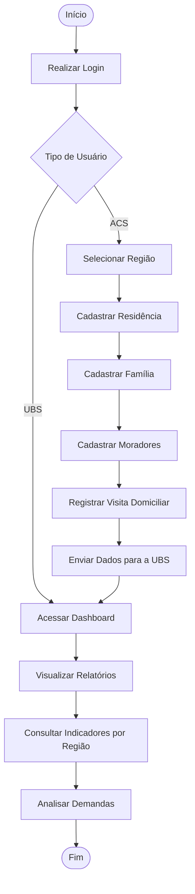

# Meu_ACS

O Meu ACS é um sistema web desenvolvido para apoiar o trabalho dos Agentes Comunitários de Saúde (ACS), permitindo o cadastro e atualização de famílias, moradores e visitas domiciliares, além da geração de relatórios para as Unidades Básicas de Saúde (UBS).

------------------------------ Motivação ------------------------------

O projeto surgiu da necessidade de reduzir o uso de registros em papel, agilizar o atendimento das famílias e facilitar o envio das informações coletadas pelos agentes às UBS. A solução busca otimizar o tempo de trabalho dos ACS e melhorar o planejamento das ações de saúde na comunidade.

------------------------------ Escopo do Projeto ------------------------------

Funcionalidades incluídas:
- Login de usuários (ACS e UBS);
- Cadastro de residências;
- Cadastro de famílias;
- Cadastro de moradores;
- Registro de visitas domiciliares;
- Consulta e atualização de dados;
- Geração de relatórios por região;
- Dashboard para acompanhamento das informações.
  
Fora do escopo inicial:
- Aplicativo mobile;
- Integração com geolocalização (Google Maps);
- Notificações em tempo real;
- Integração com sistemas externos da Secretaria de Saúde.

------------------------------ Fluxo de Utilização ------------------------------

UBS cadastra o ACS
        ↓
ACS realiza login
        ↓
ACS cadastra residência
        ↓
ACS cadastra família
        ↓
ACS cadastra moradores
        ↓
ACS registra visitas
        ↓
Sistema envia os dados para a UBS
        ↓
UBS acompanha indicadores e gera relatórios

------------------------------ Fluxograma ------------------------------

------------------------------ Requisitos Funcionais -----------------------------

RF01 – Permitir autenticação de usuários.
RF02 – Permitir cadastro de residências.
RF03 – Permitir cadastro de famílias.
RF04 – Permitir cadastro e atualização de moradores.
RF05 – Permitir registrar visitas domiciliares.
RF06 – Permitir consulta e edição dos dados cadastrados.
RF07 – Gerar relatórios por região.
RF08 – Permitir que a UBS acompanhe indicadores e demandas da região.

------------------------------ Tecnologias Utilizadas ------------------------------

Flutter
Dart
Spring Boot
Java
MySQL
REST API
Azure
Git e GitHub
Figma (protótipos)
Scrum
RUP
